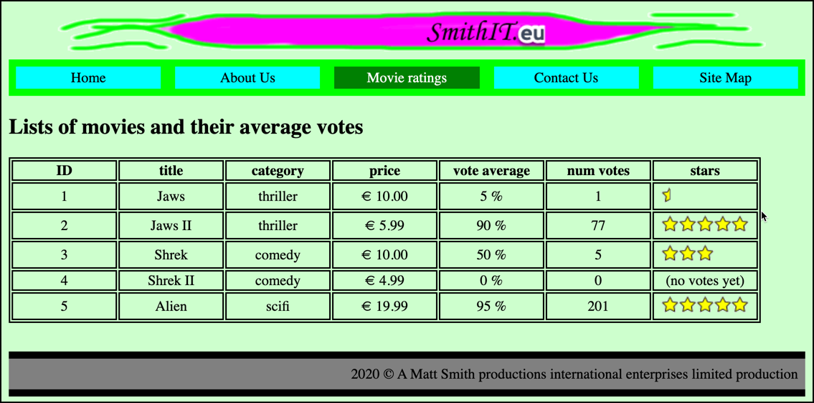

# evote-movie-2020

## About
This is a sequence of progressive enhancements, taking a static HTML site into an authenticated modern PHP MVC website

The website is about movies and user voted stars.

## Progressive enhancement 

1. Starting point
    - a flat HTML website with hardcoded links
    
    - https://github.com/dr-matt-smith/evote-movie-2020-01-basic-html

2. Change HTML to PHP
      - change all `.html` file extension to `.php` 
      - in every page change the navigation links to files ending with `.php`
      
      - https://github.com/dr-matt-smith/evote-movie-2020-02-all-files-dot-php

3. Add Front Controller PHP OO architecture
    - move all display pages into folder `/templates`
    - move images and css into new folder `/public`
    - add root website script `/public/index.php` to create `WebApplication` object and invoke `run()` method
    - change all navigation links to the form `/index.php?action=<PAGE>`
     - e.g. `/index.php?action=about` for link to about page
    - create `src` folder containing classes `WebApplication` and `MainController`
    - create `WebApplication` class to test for value of `GET` variable `action` and choose which `MainController` method to invoke
    - create `MainController` class with methods to display each of the page templates
    - create `composer.json` to define PHP namespaced `Tudublin` classes in `/src`

    - https://github.com/dr-matt-smith/evote-movie-2020-03-front-controller
      
4. Added Twig library to the project and converted page templates

    - use Composer to add `twig/twig` library to project
    - add a Twig object in `MainController` constructor
    - rename all files in `/templates` folder in form `<PAGE>.html.twig`
    - update `MainController` methods to use `Twig` object to create and print HTML for each template
    
    - https://github.com/dr-matt-smith/evote-movie-2020-04-twig-templates

5. Twig master page template and child-page inheritance 
    - move all common header and nav and footer content to `/templates/_base.html.twig`
    - define overridable head `title` Twig block in base template
    - define overridable `main` Twig block in base template
    - make all other template pages extend base and override `main` Twig block    
    
    - NOTE: we have lost and current page nav indicator - we'll fix this soon :-)

    - https://github.com/dr-matt-smith/evote-movie-2020-05-twig-base-template-inheritance

6. Use Twig blocks for CSS style to indicate current page indicated in nav bar CSS

    - controller functions to pass values

    - https://github.com/dr-matt-smith/evote-movie-2020-06-twig-current-page-block

7. List details from array of `Movie` objects

    - declare a PHP class `Movie` and pass an array of `Movie` objects to the movie list Twig page, and loop through to create table
    
    - https://github.com/dr-matt-smith/evote-movie-2020-07-movie-class-loop

8. Add PDO DB library and get Movies from database table

    - https://github.com/dr-matt-smith/evote-movie-2020-08-movie-db-table
    
9. Links to delete movies from the database

    - https://github.com/dr-matt-smith/evote-movie-2020-09-link-delete
    
10. Form to CREATE new Movies and insert them into DB

    - https://github.com/dr-matt-smith/evote-movie-2020-10-create-movie

11. Form to EDIT movies

    - https://github.com/dr-matt-smith/evote-movie-2020-11-edit-movie

12. Controller superclass, creating Twig object

    - https://github.com/dr-matt-smith/evote-movie-2020-12-controller-superclass
        
13. Login to protect the database CRUD

    - https://github.com/dr-matt-smith/evote-movie-2020-13-login-security

14. login username/password in DB

    - https://github.com/dr-matt-smith/evote-movie-2020-14-db-users

15. Hashed passwords in the DB 

    - https://github.com/dr-matt-smith/evote-movie-2020-15-hashed-passwords

16. Form to create new DB user

    - https://github.com/dr-matt-smith/evote-movie-2020-16-user-create

## Steps todo ... 

- List CHEAP movies - custom SQL method in Repository class

- Movie-Category - DB many-to-one relationship
    
- Movie Charts - DB Many-to-many relationship

- different user ROLES - users can post comments ...

- public comments form

- Sticky forms if validation error

- Web user testing (acceptance testing with Codeception)

